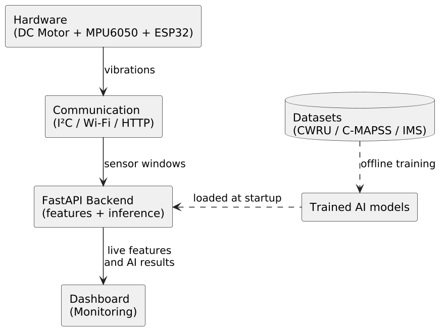
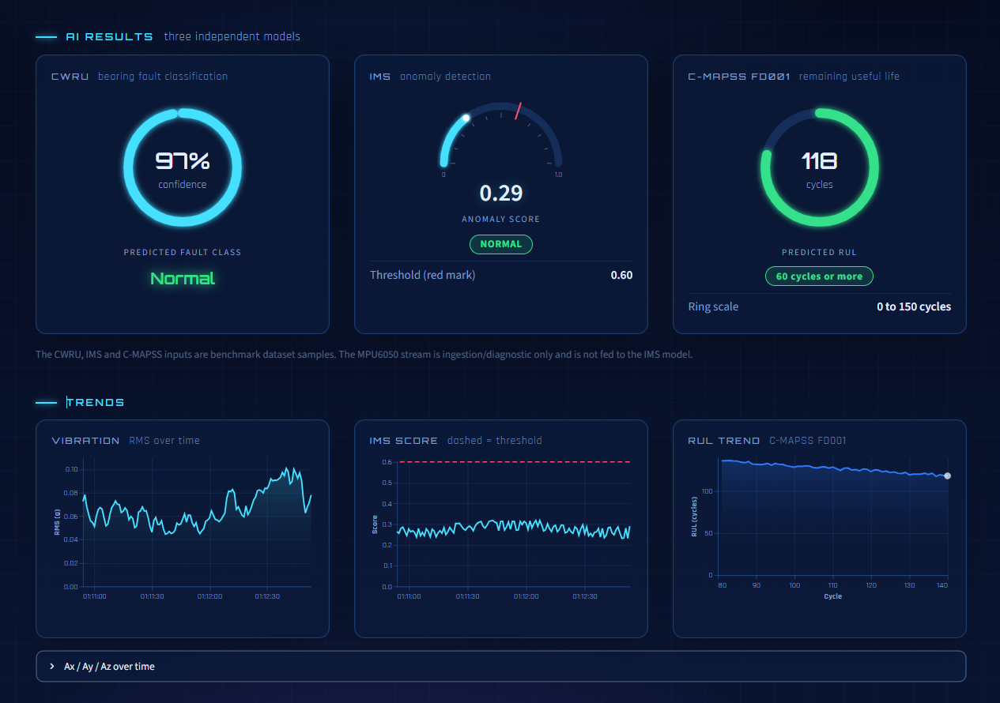

# Intelligent Bearing Fault Detection and Remaining Health Assessment

A predictive maintenance system for industrial machines, combining three AI models (fault classification, remaining useful life prediction, anomaly detection), a real-time IoT pipeline, and a monitoring dashboard.

## 🎯 Objective

Detect bearing faults, estimate a motor's Remaining Useful Life (RUL), and detect vibration anomalies in real time, using sensor data simulated via an ESP32.

## 🏗️ Architecture

```
Machine/Motor → Sensors (MPU6050) → ESP32 → Wi-Fi/MQTT → Backend (FastAPI) → AI Models → Dashboard (Streamlit)
```



## 🧠 AI Components

| Component | Dataset | Task | Final model |
|---|---|---|---|
| 1 — Fault classification | CWRU (Case Western Reserve University) | Normal / Ball fault / Inner-race / Outer-race | *[name of the selected ML model]* |
| 2 — RUL prediction | NASA C-MAPSS (FD001) | Remaining Useful Life | *[name of the selected DL model]* |
| 3 — Anomaly detection | NASA IMS | Unsupervised anomaly detection (vibration signals) | Isolation Forest (trained on healthy data only) |

## 📁 Project structure

```
├── notebooks/
│   ├── cwru/
│   ├── cmapss/
│   │   ├── ML/
│   │   ├── DL/
│   │   └── model_comparison.ipynb
│   └── ims/
├── models/              
├── api/                 # FastAPI backend
│   ├── app.py
│   ├── model_loader.py
│   ├── inference_cwru.py
│   ├── inference_cmapss.py
│   ├── inference_ims.py
│   ├── inference_sensor.py
│   └── schemas.py
├── tests/         
│   ├── conftest.py
│   ├── test_cwru.py
│   ├── test_cmapss.py
│   ├── test_ims.py
│   ├── test_sensor.py
│   └── test_health.py
├── tools/         
│   ├── generate_test_payloads.py
│   ├── generate_real_test_payloads.py
│   ├── inspect_models.py
│   ├── test_api.py
│   └── sample_payloads/
├── iot/              
├── dashboard/         
└── docs/
```

## ⚙️ Installation

```bash
git clone https://github.com/<your-user>/<your-repo>.git
cd <your-repo>
python -m venv venv
source venv/bin/activate   # or venv\Scripts\activate on Windows
pip install -r requirements.txt
```

## 🚀 Usage

**1. Run the API (FastAPI)**
```bash
cd api
uvicorn app:app --reload
```

**2. Run the sensor stream simulator (MQTT)**
```bash
python iot/mqtt_simulator/simulate.py
```

**3. Run the dashboard**
```bash
streamlit run dashboard/streamlit_app.py
```

## ✅ Tests

25 automated tests covering the three prediction endpoints:
```bash
pytest tests/
```

Utility scripts are available in `tools/` to generate test payloads (`generate_test_payloads.py`, `generate_real_test_payloads.py`) and inspect loaded models (`inspect_models.py`).

## 📦 Models

Trained models are too large to be committed directly to GitHub. They are available here: *[GitHub Release / Hugging Face / Drive link]*.

Place them in `models/` after downloading, or run:
```bash
python tools/inspect_models.py
```
to verify the models load correctly once placed.

## 📊 Demo



## 🏢 Context

Internship project carried out at **ELYOS DIGITAL**, under the supervision of Salma KALLELA — ENSI.

## 📜 License

*[To be defined — e.g. MIT]*
